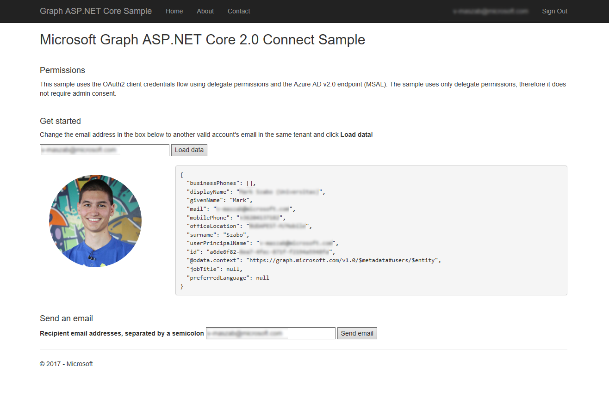

# Graph webhooks exercise

This is a ASP .NET Core app and can be loaded through VS 2017.  It uses
both the Microsoft Authentication Library (MSAL) and the Microsoft Graph SDK.
It's partially completed, and the instuctions walk through the steps you'll need
to take to complete the exercise - by adding code and guidance on what to add in the right places, such as:

```C#
/// <exercise_hint>
/// Some hints that can help you.
/// This topic also provides relevant background https://developer.microsoft.com/en-us/graph/docs/concepts/delta_query_users
/// </exercise_hint>

/// ADD CODE HERE
```

## Pre-requisites

1. VS 2017 
2. .NET Core 2.1 SDK
3. Azure web app ex: https://YOURWEBAPP.azurewebsites.net/ . Steps [here](https://docs.microsoft.com/en-us/azure/app-service/app-service-web-get-started-dotnet)

## Instructions

### Getting started

1. Clone or download the repo from here: https://github.com/Azure-Samples/active-directory-coding-exercises
2. Go to the `dev015-making-apps-more-powerful\02-webhooks` folder and open the solution file in VS 2017
3. Go to the private preview app registration experience at http://aka.ms/appregprivatepreview . Register a new single tenant app, and create a new secret.  Also get the client id. Configure the app with **openid**, **email**, **profile**, **offline_access**, **User.Read**, **User.ReadBasic.All** and **Mail.Send** permissions and then **grant** the app this permission. Also ensure the redirect uri is set to https://YOURWEBAPP.azurewebsites.net/signin-oidc.
4. Update appSettings.json file as below:
   * a. For the **ClientId** key, replace `ENTER_YOUR_APP_ID` with the application ID of your registered application.  
   * b. For the **ClientSecret** key, replace `ENTER_YOUR_SECRET` with the password of your registered application. Note that in production 
   apps you should always use certificates as your application secrets, but for this sample we will use a simple shared secret password.
   * c. For the **NotificationUrl**, replace "ENTER_YOUR_NOTIFYURL" with the Microsoft Azure Web App (ex: https://YOURWEBAPP.azurewebsites.net/.
   * d. For the **BaseUrl**, replace "ENTER_YOUR_APP_URL" with the Microsoft Azure Web App (ex: https://YOURWEBAPP.azurewebsites.net/)
5. Publish app to Azure from [VS 2017](https://docs.microsoft.com/en-us/aspnet/core/tutorials/publish-to-azure-webapp-using-vs?view=aspnetcore-2.1).

The screenshot below shows the app's start page.
  


## Key components of the sample

The following files contain code that's related to connecting to Microsoft Graph, loading user data and sending emails.

* [`appsettings.json`](MicrosoftGraphAspNetCoreConnectSample/appsettings.json) Contains values used for authentication and authorization. 
* [`Startup.cs`](MicrosoftGraphAspNetCoreConnectSample/Startup.cs) Configures the app and the services it uses, including authentication.
* [`GraphAuthProvider.cs`](MicrosoftGraphAspNetCoreConnectSample/Helpers/GraphAuthProvider.cs) Gets an access token using MSAL's **AcquireTokenSilentAsync** method.
* [`GraphSdkHelper.cs`](MicrosoftGraphAspNetCoreConnectSample/Helpers/GraphSDKHelper.cs) Initiates the SDK client used to interact with Microsoft Graph.
* [`GraphService.cs`](MicrosoftGraphAspNetCoreConnectSample/Helpers/GraphService.cs) Contains methods that use the **GraphServiceClient** to build and send calls to the Microsoft Graph service and to process the response.
  * The **GetUserJson** action gets the user's profile by an email adress and converts it to JSON.
  * The **GetPictureBase64** action gets the user's profile picture and converts it to a base64 string.
  * The **SendEmail** action sends an email on behalf of the current user.
* [`SessionTokenCache.cs`](MicrosoftGraphAspNetCoreConnectSample/Helpers/SessionTokenCache.cs) Sample implementation of an in-memory token cache. Production apps will typically use some method of persistent storage.

## Copyright

Copyright (c) 2018 Microsoft. All rights reserved.
